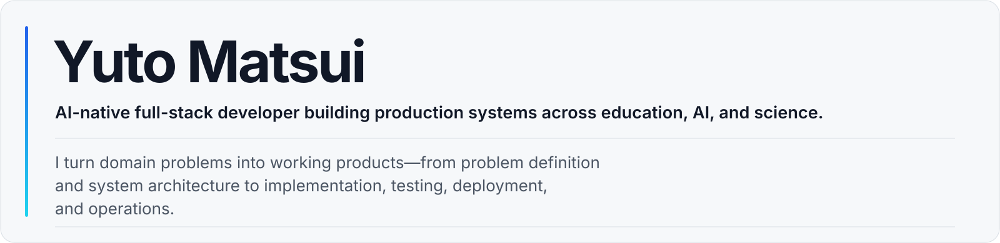
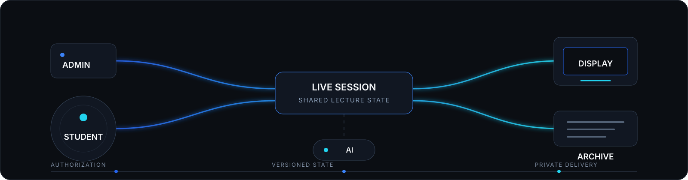
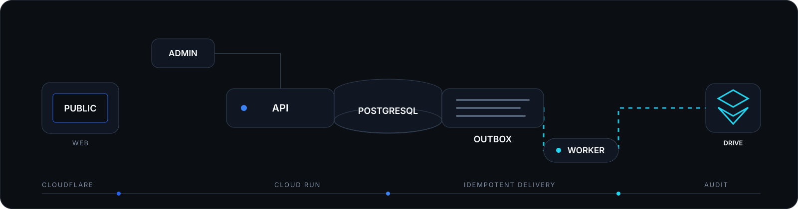

<picture>
  <source media="(max-width: 600px)" srcset="./assets/yuto-matsui-masthead-mobile.svg">
  
</picture>

  

 

## COMPASS Interactive

**Founder · Product Owner · Lead Developer**

A full-stack learning platform connecting students, instructors, classroom displays, and post-lecture archives.

<picture>
  <source media="(max-width: 600px)" srcset="./assets/compass-interactive-system-mobile.svg">
  
</picture>

**[Product Overview](https://compass-official.pages.dev/INTRO_Interactive/)** · **[Portfolio for Developers](https://compass-official.pages.dev/INTRO_Interactive/developers/)** · **[Source Code](https://github.com/genellect/compass-interactive)**

  
  
  
  
  
  

- Designed Student, Admin, Display, and Archive experiences around a shared lecture lifecycle
- Implemented authentication, ownership, and authorization with Supabase Auth, PostgreSQL, Row Level Security, and RPC
- Built versioned state synchronization with visibility-aware polling, retry control, and failure backoff
- Separated browser-facing state, protected server operations, and private document delivery
- Structured AI execution around authorization, concurrency limits, budget control, usage accounting, validation, and human review
- Established validation across the frontend, database policies, serverless functions, browsers, and end-to-end lecture workflows

> COMPASS Interactive is source-available through its public production repository.

 

## COMPASS Platform

**Founder · Product Owner · Full-Stack Developer**

The public website and registration platform for COMPASS, a student-led education and technology initiative.

<picture>
  <source media="(max-width: 600px)" srcset="./assets/compass-platform-system-mobile.svg">
  
</picture>

**[Production](https://compass-official.pages.dev/)** · **[Source Code](https://github.com/genellect/compass)**

  
  
  
  
  
  

- Built the public website and registration interface with Next.js and Cloudflare Pages
- Implemented Google account authentication, server-side ID-token verification, eligibility evaluation, and registration APIs with FastAPI
- Established PostgreSQL as the source of truth for users, applications, identities, permissions, operations, and audit history
- Implemented asynchronous Google Drive permission management with transactional outbox processing, idempotency, leases, retries, and recovery states
- Separated Public API, Admin API, Worker, Migration, and Database responsibilities, with administrative workflows for access management, migration, auditing, and verified exports
- Defined Cloud Run infrastructure, IAM, secrets, monitoring, and deployment with Terraform
- Established automated validation across the web application, APIs, database, migrations, infrastructure, security, and external integrations

 

## Research Background

I am also a molecular biology researcher studying the molecular mechanisms of ALS/FTD, with a focus on C9orf72-associated neurodegeneration.

I apply software engineering, automation, image analysis, and AI to research and education workflows.
